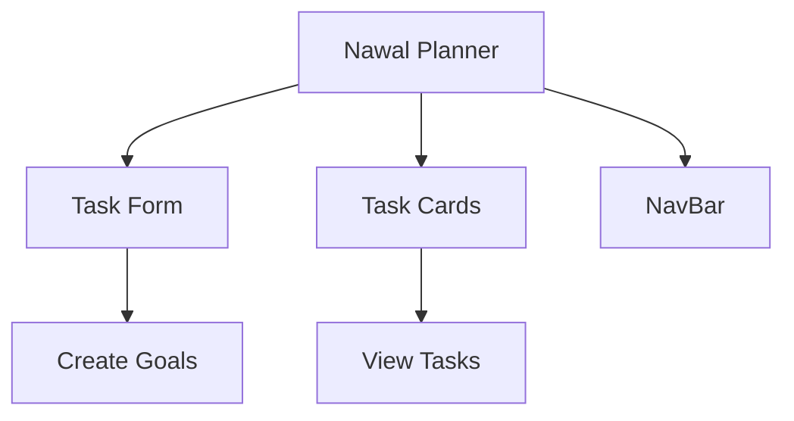

# Nawal Planner 🌿  

  
  
  
  

Aplicación de planificación inspirada en la cosmovisión maya, construida con Vite + React.  



## Instalación

### Método tradicional  
1. Clonar repositorio:
```bash
git clone https://github.com/EsvinAmbrocio/nawal-planner
```

2. Instalar dependencias:
```bash
cd nawal-planner
npm install
```

3. Iniciar servidor de desarrollo:
```bash
npm run dev
```

### Método con Docker  
Ejecuta el siguiente comando:  
```bash
docker run --rm -it -p 5173:5173 -v ${PWD}:/app -w /app node:22.15-alpine npm install
docker run --rm -it -p 5173:5173 -v ${PWD}:/app -w /app node:22.15-alpine npm run dev
docker run --rm -it --network host -p 5173:5173 -v ${PWD}:/app -w /app node:22.15-alpine npm run dev
```

La aplicación estará disponible en:  
**http://localhost:5173**

## Estructura del Código

```
src/
├── App.scss            # Estilos con energía nawal
├── App.jsx             # Componente raíz
├── components/
│   ├── NavBar/         # Barra de navegación sagrada
│   ├── TaskForm/       # Formulario de creación
│   └── TaskCard/       # Representación de tareas
```

---

> "En el nawal de tu destino, cada tarea es un paso sagrado" - Popol Vuh Dev 3.0
