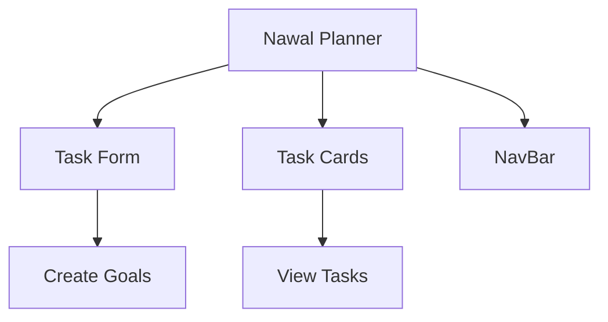

# Nawal Planner 🌿  

  
  
  
  

Aplicación de planificación inspirada en la cosmovisión maya, construida con Vite + React.  



## Instalación

### Variables de entorno

Copia el archivo `.env.example` a `.env` y configura las variables según tu entorno:

```bash
cp .env.example .env
```

- `VITE_API_URL`: URL base del backend (ejemplo: http://localhost:3000)
- `VITE_API_TOKEN`: Token de autenticación Bearer (si aplica)

### Método tradicional  
1. Clonar repositorio:
```bash
git clone https://github.com/EsvinAmbrocio/nawal-planner
```

2. Instalar dependencias:
```bash
cd nawal-planner
npm install
```

3. Iniciar servidor de desarrollo:
```bash
npm run dev
```

### Método con Docker  
Ejecuta el siguiente comando:  
```bash
docker run --rm -it -p 5173:5173 -v ${PWD}:/app -w /app node:22.15-alpine npm install
docker run --rm -it -p 5173:5173 -v ${PWD}:/app -w /app node:22.15-alpine npm run dev
docker run --rm -it --network host -p 5173:5173 -v ${PWD}:/app -w /app node:22.15-alpine npm run dev
```

La aplicación estará disponible en:  
**http://localhost:5173**

## Estructura del Código

```
src/
├── App.scss            # Estilos con energía nawal
├── App.jsx             # Componente raíz
├── api/                # Cliente API centralizado
│   ├── ApiClient.js    # Clase ApiClient
│   └── index.js        # Instancia global de ApiClient
├── components/
│   ├── NavBar/         # Barra de navegación
│   ├── TaskForm/       # Formulario de creación/edición
│   ├── TaskCard/       # Tarjeta de tarea/meta
│   └── TaskList/       # (Reservado para futuras listas)
├── features/
│   ├── goal/           # Redux slice para metas
│   ├── option/         # Redux slice para opción seleccionada
│   └── todo/           # Redux slice para tareas
├── hooks/              # Custom hooks (useFetchByOption)
├── types/              # Tipos y utilidades
└── app/                # Configuración de store redux
```

## Características principales

- **API centralizada** con autenticación Bearer opcional
- **Redux Toolkit** para manejo de estado de tareas, metas y opción seleccionada
- **Sincronización automática** entre menú y datos mostrados
- **Soporte para endpoints dinámicos** según la opción seleccionada
- **Estilos modernos** con Bootstrap y SCSS

---

> "En el nawal de tu destino, cada tarea es un paso sagrado" - Popol Vuh Dev 3.0
